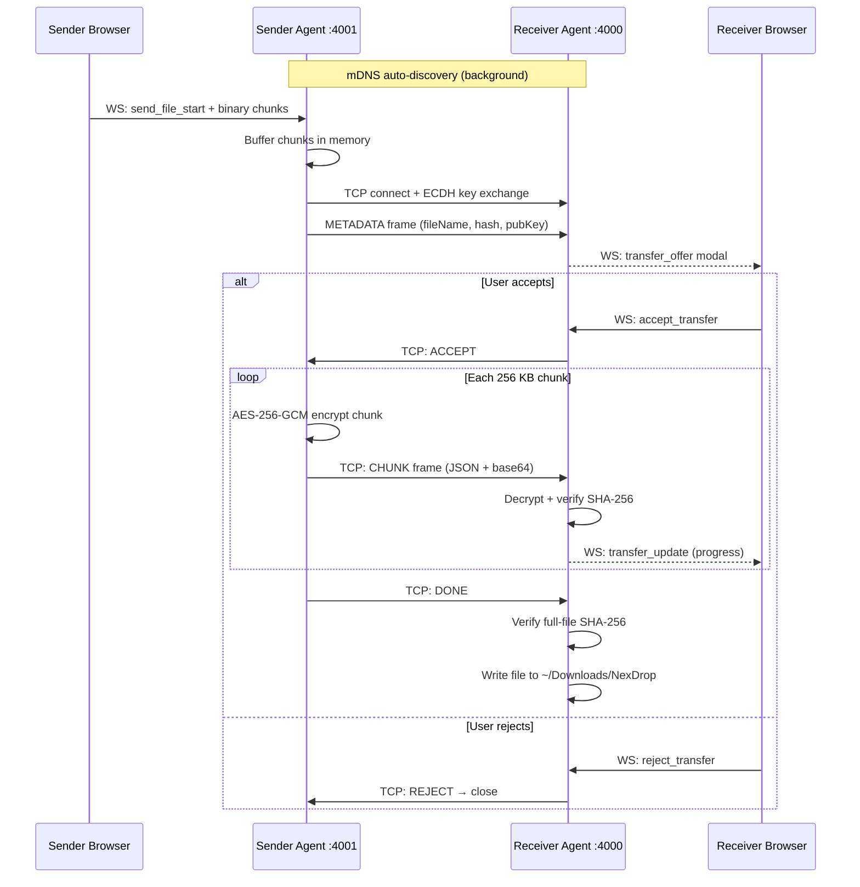
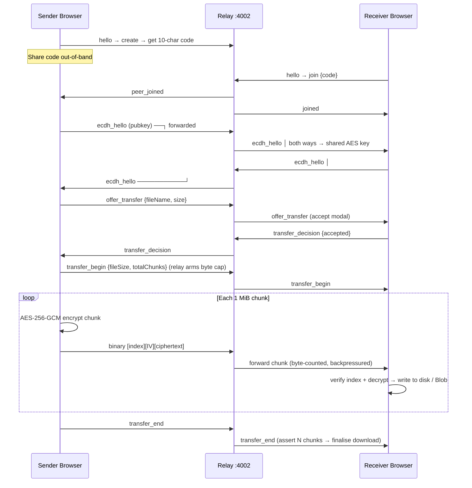

# NexDrop

> Encrypted file transfer — direct on your LAN, or internet-wide via an encrypted relay.

No accounts. No stored files. On a LAN, bytes travel directly between peers. Across the internet, bytes pass through a thin relay that only ever sees ciphertext — file **contents** are end-to-end encrypted in both modes.

---

## Table of Contents

- [Project Structure](#project-structure)
- [Tech Stack](#tech-stack)
- [Quick Start](#quick-start)
- [Architecture Overview (HLD)](#architecture-overview-hld)
  - [LAN Mode](#lan-mode)
  - [Remote Mode](#remote-mode)
- [UI Wireframes](#ui-wireframes)
- [Security Model](#security-model)

---

## Project Structure

```
NexDrop/
├── backend/                ← Node.js + TypeScript
│   ├── src/
│   │   ├── api/            ← WebSocket bridge (browser ↔ LAN agent)
│   │   ├── chunking/       ← Chunk assembler & disassembler (LAN)
│   │   ├── crypto/         ← ECDH + AES-256-GCM (LAN)
│   │   ├── discovery/      ← mDNS peer discovery (LAN)
│   │   ├── transport/      ← TCP client/server (LAN) + relayServer (Remote)
│   │   ├── index.ts        ← LAN agent entry point
│   │   └── relay.ts        ← Remote relay entry point (deployed separately)
│   └── README.md           ← Backend setup & protocol reference
├── frontend/               ← React 19 + Vite + TypeScript
│   ├── src/
│   │   ├── components/     ← DeviceCard, ProgressBar, IncomingTransferModal
│   │   ├── hooks/          ← useAgentSocket (LAN), useRemoteTransfer (Remote)
│   │   ├── lib/            ← agentSocket, remoteCrypto
│   │   └── pages/          ← Home, Lan, Remote
│   └── README.md           ← Frontend setup & component guide
├── docs/
│   └── RELAY_PROTOCOL.md   ← Remote relay wire-protocol spec
├── deploy/                 ← Relay deployment (Caddy, systemd, Docker)
├── docker-compose.yml
└── .env.example
```

---

## Tech Stack

| Layer | Technology |
|---|---|
| Backend runtime | Node.js 18+, TypeScript 5.8 |
| Frontend | React 19, Vite 7, TypeScript 5.9 |
| LAN transport | TCP (Node `net`), mDNS / Bonjour |
| Remote transport | WebSocket relay (`ws` / `wss`) |
| LAN encryption | ECDH P-256 → HKDF → AES-256-GCM + SHA-256 |
| Remote encryption | ECDH P-256 → HKDF-SHA256 → AES-256-GCM (file contents, E2E) |
| LAN discovery | mDNS service type `peerdrop._tcp` |
| Remote discovery | Relay rooms + 10-char share codes |
| Remote large files | File System Access API (stream to disk) / Blob fallback |

---

## Quick Start

```bash
# 1. Clone and enter project root
git clone <repo> && cd NexDrop

# 2. LAN mode — start the agent (new terminal)
cd backend && npm install && npm run dev

# 3. Remote mode — start the relay (new terminal)
cd backend && npm run relay:dev

# 4. Start the frontend (new terminal)
cd frontend && npm install && npm run dev
```

- Frontend: http://localhost:5173
- LAN agent WebSocket: ws://localhost:4001
- Remote relay WebSocket: ws://localhost:4002

The LAN agent (`npm run dev`) and the relay (`npm run relay:dev`) are independent
processes — run only what you need. See [backend/README.md](backend/README.md)
and [frontend/README.md](frontend/README.md) for full setup, and
[deploy/README.md](deploy/README.md) to host the relay in the cloud.

---

## Architecture Overview (HLD)

### LAN Mode

Devices on the same network communicate via TCP with mDNS auto-discovery. The browser delegates all networking to a local Node.js agent running on the same machine.

```
┌─────────────────────────────────────────────────────────────┐
│                       Machine A                             │
│  ┌─────────────┐   WS (4001)   ┌───────────────────────┐   │
│  │   Browser   │◄─────────────►│     NexDrop Agent      │   │
│  │  (React UI) │               │  ┌──────────────────┐  │   │
│  └─────────────┘               │  │  mDNS Discovery  │  │   │
│                                │  │  TCP Server :4000│  │   │
│                                │  │  TCP Client      │  │   │
│                                │  └──────────────────┘  │   │
│                                └──────────┬────────────┘   │
└───────────────────────────────────────────┼─────────────────┘
                                            │ TCP :4000
                              ECDH + AES-256-GCM encrypted
                                            │
┌───────────────────────────────────────────┼─────────────────┐
│                       Machine B           │                  │
│                                ┌──────────▼────────────┐   │
│  ┌─────────────┐   WS (4001)   │     NexDrop Agent      │   │
│  │   Browser   │◄─────────────►│  ┌──────────────────┐  │   │
│  │  (React UI) │               │  │  TCP Server :4000│  │   │
│  └─────────────┘               │  │  mDNS Discovery  │  │   │
│                                │  └──────────────────┘  │   │
│                                └───────────────────────┘   │
└─────────────────────────────────────────────────────────────┘
                    ▲                      ▲
                    └──── mDNS multicast ──┘
                         (auto-discovery)
```



---

### Remote Mode

Devices on different networks connect through a small WebSocket **relay**. The
relay pairs the two browsers by share code and forwards opaque, end-to-end
encrypted chunks between them. It never sees file contents or the encryption
key — only ciphertext bytes, sizes, file name, and timing. There is no agent in
the Remote data path; both ends are pure browser. Full spec:
[docs/RELAY_PROTOCOL.md](docs/RELAY_PROTOCOL.md).

```
Sender Browser ─── wss ───► Relay (cloud) ─── wss ───► Receiver Browser
        host or joiner       pairs 2 conns        joiner or host
  File contents E2EE: ECDH P-256 → HKDF-SHA256 → AES-256-GCM
  Relay sees: ciphertext chunks, byte counts, file name/size, timing, peer IPs
  Relay never sees: file contents (plaintext), the encryption key
```



---

## UI Wireframes

### Home Page — Mode Selection

```
┌─────────────────────────────────────────────────────────┐
│                        NexDrop                          │
│              Secure Peer-to-Peer File Transfer           │
│                                                         │
│   ┌──────────────────────┐  ┌──────────────────────┐   │
│   │                      │  │                      │   │
│   │    ◎  LAN Mode        │  │    ◉  Remote Mode     │   │
│   │                      │  │                      │   │
│   │  Same network only   │  │   Any network, any   │   │
│   │  Fastest transfer    │  │   device worldwide   │   │
│   │  Auto-discovery      │  │   Share code needed  │   │
│   │                      │  │                      │   │
│   └──────────────────────┘  └──────────────────────┘   │
└─────────────────────────────────────────────────────────┘
```

### Remote Page — Share Code & Send

```
┌─────────────────────────────────────────────────────────┐
│  ← Back          NexDrop — Remote          ● Relay     │
├─────────────────────────────────────────────────────────┤
│                                                         │
│  Your Share Code                                        │
│  ┌─────────────────────────────────────────────────┐   │
│  │              7 G 4 Q X 2 M K 9 A                │   │
│  │                                         [Copy]  │   │
│  └─────────────────────────────────────────────────┘   │
│  Share this code with the other device.                 │
│                                                         │
│  ─── OR join an existing session ───                    │
│                                                         │
│  ┌─────────────────────────────────┐  [Connect]        │
│  │  Enter share code...            │                    │
│  └─────────────────────────────────┘                    │
│                                                         │
├─────────────────────────────────────────────────────────┤
│  ● Peer Connected — Ready to transfer                   │
│                                                         │
│  Drop files here or click to browse                     │
│  Receiving: document.pdf    ████████████░░░  75%        │
└─────────────────────────────────────────────────────────┘
```

### Incoming Transfer Modal

```
┌─────────────────────────────────────────────────────────┐
│                  Incoming File Transfer                  │
│                                                         │
│   From:   Remote Peer                                   │
│   File:   vacation-photos.zip                           │
│   Size:   247 MB                                        │
│                                                         │
│   ┌───────────────────┐   ┌─────────────────────────┐  │
│   │     ✓ Accept       │   │       ✗ Reject           │  │
│   └───────────────────┘   └─────────────────────────┘  │
└─────────────────────────────────────────────────────────┘
```

---

## Security Model

| Property | LAN Mode | Remote Mode |
|---|---|---|
| Topology | Direct peer-to-peer (TCP) | Relayed (server in the byte path) |
| Key exchange | ECDH P-256 (per transfer) | ECDH P-256 (per pairing) |
| Content encryption | AES-256-GCM | AES-256-GCM (per chunk, end-to-end) |
| Integrity | SHA-256 per chunk + full file | AES-GCM tag per chunk + index + count |
| Forward secrecy | Yes (ephemeral key pair) | Yes (ephemeral key pair) |
| Relay sees file **contents** | N/A (no relay) | Never (ciphertext only) |
| Relay sees **metadata** | N/A | File name, size, timing, peer IPs |
| Transport security | LAN TCP | `wss://` (TLS) to the relay |
| Auth required | None (by design) | None — share code is the capability |

Remote mode is **end-to-end encrypted but server-relayed** — it is not pure P2P.
Only file contents are encrypted; file name and size travel as plaintext
metadata visible to the relay (a deliberate v1 trade-off — see
[docs/RELAY_PROTOCOL.md §12](docs/RELAY_PROTOCOL.md)).
