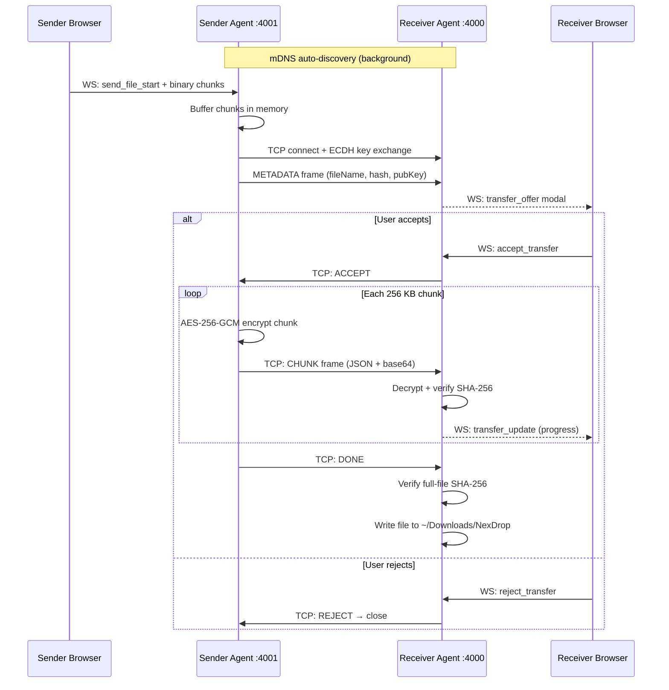
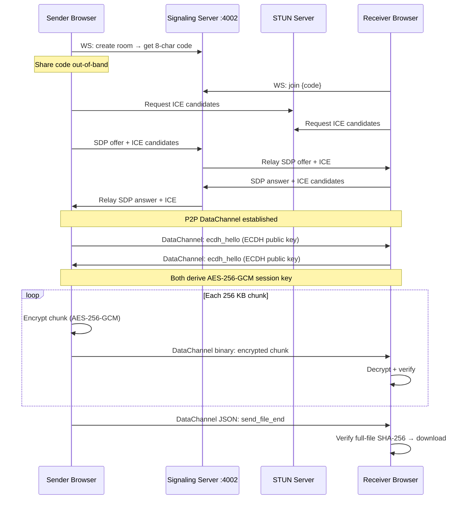

# NexDrop

> Serverless, encrypted peer-to-peer file transfer — local network or internet-wide.

No accounts. No cloud storage. Files travel directly between peers, end-to-end encrypted.

---

## Table of Contents

- [Project Structure](#project-structure)
- [Tech Stack](#tech-stack)
- [Quick Start](#quick-start)
- [Architecture Overview (HLD)](#architecture-overview-hld)
  - [LAN Mode](#lan-mode)
  - [Remote Mode](#remote-mode)
- [UI Wireframes](#ui-wireframes)
- [Security Model](#security-model)
- [Docker Deployment](#docker-deployment)
- [Environment Variables](#environment-variables)
- [Known Issues & Bugs](#known-issues--bugs)

---

## Project Structure

```
NexDrop/
├── backend/                ← Node.js + TypeScript agent
│   ├── src/
│   │   ├── api/            ← WebSocket bridge (browser ↔ agent)
│   │   ├── chunking/       ← Chunk assembler & disassembler
│   │   ├── crypto/         ← ECDH + AES-256-GCM
│   │   ├── discovery/      ← mDNS peer discovery
│   │   └── transport/      ← TCP client/server + WebRTC signaling
│   └── README.md           ← Backend setup & API reference
├── frontend/               ← React 19 + Vite + TypeScript
│   ├── src/
│   │   ├── components/     ← DeviceCard, ProgressBar, TransferModal
│   │   ├── hooks/          ← useAgentSocket, useRemoteTransfer
│   │   ├── lib/            ← agentSocket, webrtc, remoteCrypto
│   │   └── pages/          ← Home, Lan, Remote
│   └── README.md           ← Frontend setup & component guide
├── Caddyfile               ← Reverse proxy + TLS (Let's Encrypt)
├── docker-compose.yml
├── .env.example
├── ERRORS.md               ← Known bugs, security issues, performance gaps
└── CLAUDE.md               ← Project status & roadmap
```

---

## Tech Stack

| Layer | Technology |
|---|---|
| Backend runtime | Node.js 18, TypeScript 5.8 |
| Frontend | React 19, Vite 7, TypeScript 5.9 |
| LAN transport | TCP (Node `net`), mDNS / Bonjour |
| Remote transport | WebRTC `RTCDataChannel` |
| LAN encryption | ECDH P-256 → HKDF → AES-256-GCM + SHA-256 |
| Remote encryption | DTLS (WebRTC) + app-layer ECDH P-256 |
| LAN discovery | mDNS service type `peerdrop._tcp` |
| Remote discovery | WebSocket signaling + 8-char share codes |
| NAT traversal | STUN (configurable), optional TURN |
| Reverse proxy | Caddy (auto TLS via Let's Encrypt) |

---

## Quick Start

```bash
# 1. Clone and enter project root
git clone <repo> && cd NexDrop

# 2. Start backend (new terminal)
cd backend && npm install && npm run dev

# 3. Start frontend (new terminal)
cd frontend && npm install && npm run dev
```

- Frontend: http://localhost:5173
- Backend WebSocket: ws://localhost:4001
- Signaling: ws://localhost:4002

See [backend/README.md](backend/README.md) and [frontend/README.md](frontend/README.md) for full setup details.

---

## Architecture Overview (HLD)

### LAN Mode

Devices on the same network communicate via TCP with mDNS auto-discovery. The browser delegates all networking to a local Node.js agent running on the same machine.

```
┌─────────────────────────────────────────────────────────────┐
│                       Machine A                             │
│  ┌─────────────┐   WS (4001)   ┌───────────────────────┐   │
│  │   Browser   │◄─────────────►│     NexDrop Agent      │   │
│  │  (React UI) │               │  ┌──────────────────┐  │   │
│  └─────────────┘               │  │  mDNS Discovery  │  │   │
│                                │  │  TCP Server :4000│  │   │
│                                │  │  TCP Client      │  │   │
│                                │  └──────────────────┘  │   │
│                                └──────────┬────────────┘   │
└───────────────────────────────────────────┼─────────────────┘
                                            │ TCP :4000
                              ECDH + AES-256-GCM encrypted
                                            │
┌───────────────────────────────────────────┼─────────────────┐
│                       Machine B           │                  │
│                                ┌──────────▼────────────┐   │
│  ┌─────────────┐   WS (4001)   │     NexDrop Agent      │   │
│  │   Browser   │◄─────────────►│  ┌──────────────────┐  │   │
│  │  (React UI) │               │  │  TCP Server :4000│  │   │
│  └─────────────┘               │  │  mDNS Discovery  │  │   │
│                                │  └──────────────────┘  │   │
│                                └───────────────────────┘   │
└─────────────────────────────────────────────────────────────┘
                    ▲                      ▲
                    └──── mDNS multicast ──┘
                         (auto-discovery)
```



---

### Remote Mode

Devices on different networks connect browser-to-browser via WebRTC. The signaling server only relays SDP/ICE handshake messages — it never sees file bytes.

```
Browser A                  Signaling Server             Browser B
    │                          :4002                        │
    │◄── WS ──────────────────────────────────── WS ───────►│
    │                                                        │
    │  ① Create room / get share code                        │
    │  ② Share code out-of-band (copy/paste)                 │
    │                    ③ B joins with code                 │
    │◄── SDP offer ──────────────────────────────────────────│
    │──── SDP answer ────────────────────────────────────────►│
    │◄── ICE candidates ◄──────────────────────────────────── │
    │──── ICE candidates ────────────────────────────────────►│
    │                                                        │
    │◄════════════ WebRTC DataChannel (P2P) ════════════════►│
    │              DTLS + ECDH P-256 + AES-256-GCM           │
    │                    file bytes only                     │
```



---

## UI Wireframes

### Home Page — Mode Selection

```
┌─────────────────────────────────────────────────────────┐
│                        NexDrop                          │
│              Secure Peer-to-Peer File Transfer           │
│                                                         │
│   ┌──────────────────────┐  ┌──────────────────────┐   │
│   │                      │  │                      │   │
│   │    ◎  LAN Mode        │  │    ◉  Remote Mode     │   │
│   │                      │  │                      │   │
│   │  Same network only   │  │   Any network, any   │   │
│   │  Fastest transfer    │  │   device worldwide   │   │
│   │  Auto-discovery      │  │   Share code needed  │   │
│   │                      │  │                      │   │
│   └──────────────────────┘  └──────────────────────┘   │
└─────────────────────────────────────────────────────────┘
```

### LAN Page — Peer Discovery & Send

```
┌─────────────────────────────────────────────────────────┐
│  ← Back          NexDrop — LAN            ● Connected   │
├─────────────────────────────────────────────────────────┤
│  Nearby Devices                           [Scan Again]  │
│  ┌──────────────┐  ┌──────────────┐  ┌──────────────┐  │
│  │  💻 Alice's  │  │  📱 Bob's    │  │  🖥 Server   │  │
│  │  MacBook     │  │  iPhone      │  │  Desktop     │  │
│  │  192.168.1.2 │  │  192.168.1.5 │  │  192.168.1.8 │  │
│  │  [Selected ✓]│  │  [ Select ]  │  │  [ Select ]  │  │
│  └──────────────┘  └──────────────┘  └──────────────┘  │
├─────────────────────────────────────────────────────────┤
│  Drop files here or click to browse                     │
│  ┌───────────────────────────────────────────────────┐  │
│  │                                                   │  │
│  │           ↑  Drag & Drop Files Here               │  │
│  │                                                   │  │
│  └───────────────────────────────────────────────────┘  │
│  [ Send to Alice's MacBook ]                            │
├─────────────────────────────────────────────────────────┤
│  Transfer History                                       │
│  ─────────────────────────────────────────────          │
│  report.pdf → Alice's MacBook     ████████░░  80%       │
│  photo.jpg  ← Bob's iPhone        ██████████ Done ✓     │
└─────────────────────────────────────────────────────────┘
```

### Remote Page — Share Code & Send

```
┌─────────────────────────────────────────────────────────┐
│  ← Back          NexDrop — Remote         ● Signaling  │
├─────────────────────────────────────────────────────────┤
│                                                         │
│  Your Share Code                                        │
│  ┌─────────────────────────────────────────────────┐   │
│  │              A B C D 1 2 3 4                    │   │
│  │                                         [Copy]  │   │
│  └─────────────────────────────────────────────────┘   │
│  Share this code with the other device.                 │
│                                                         │
│  ─── OR join an existing session ───                    │
│                                                         │
│  ┌─────────────────────────────────┐  [Join Room]       │
│  │  Enter share code...            │                    │
│  └─────────────────────────────────┘                    │
│                                                         │
├─────────────────────────────────────────────────────────┤
│  ● Peer Connected — Ready to transfer                   │
│                                                         │
│  Drop files here or click to browse                     │
│  ┌───────────────────────────────────────────────────┐  │
│  │           ↑  Drag & Drop Files Here               │  │
│  └───────────────────────────────────────────────────┘  │
│  [ Send File ]                                          │
│                                                         │
│  Receiving: document.pdf    ████████████░░░  75%        │
└─────────────────────────────────────────────────────────┘
```

### Incoming Transfer Modal

```
┌─────────────────────────────────────────────────────────┐
│                  Incoming File Transfer                  │
│                                                         │
│   From:   Bob's iPhone                                  │
│   File:   vacation-photos.zip                           │
│   Size:   247 MB  (987 chunks)                          │
│                                                         │
│   ┌───────────────────┐   ┌─────────────────────────┐  │
│   │     ✓ Accept       │   │       ✗ Reject           │  │
│   └───────────────────┘   └─────────────────────────┘  │
│                                                         │
│   Auto-rejects in 42 seconds                            │
└─────────────────────────────────────────────────────────┘
```

---

## Security Model

| Property | LAN Mode | Remote Mode |
|---|---|---|
| Key exchange | ECDH P-256 (per transfer) | ECDH P-256 (per DataChannel) |
| Encryption | AES-256-GCM | AES-256-GCM (app-layer) + DTLS |
| Integrity | SHA-256 per chunk + full file | SHA-256 per chunk + full file |
| Forward secrecy | Yes (ephemeral key pair) | Yes (ephemeral key pair) |
| Server sees file bytes | Never | Never |
| Auth required | None (by design) | None (by design) |

---

## Docker Deployment

```bash
# 1. Copy environment and fill in values
cp .env.example .env

# 2. Start without TLS (development)
docker compose up --build

# 3. Start with TLS (production) — requires NEXDROP_DOMAIN set in .env
docker compose --profile tls up --build
```

| Service | Port | Description |
|---|---|---|
| frontend | 3000 | React SPA (nginx) |
| backend | 4000 | TCP receive (LAN) |
| backend | 4001 | WebSocket API (browser ↔ agent) |
| backend | 4002 | WebRTC signaling relay |
| caddy | 80, 443 | TLS reverse proxy (profile: tls) |

> **LAN Mode + Docker:** mDNS multicast does not work on Docker's default bridge.
> On Linux use `network_mode: "host"` for the backend service.
> On macOS/Windows, run the backend natively and containerize only the frontend.

---

## Environment Variables

See [.env.example](.env.example) for the full list. Key variables:

| Variable | Default | Description |
|---|---|---|
| `TCP_PORT` | `4000` | LAN TCP receive port |
| `WS_API_PORT` | `4001` | Browser ↔ agent WebSocket port |
| `SIGNALING_PORT` | `4002` | WebRTC signaling port |
| `DEVICE_NAME` | hostname | Peer display name |
| `ALLOW_REMOTE_WS` | `false` | Allow non-localhost WS (ngrok) |
| `WS_ALLOWED_ORIGIN` | `http://localhost:5173` | CORS origin for WS API |
| `DOWNLOAD_DIR` | `~/Downloads/NexDrop` | Where received files are saved |
| `SIGNALING_MAX_CONN_PER_IP` | `5` | Max WebSocket connections per IP |
| `SIGNALING_MAX_MSG_PER_SEC` | `20` | Max signaling messages per second |
| `SIGNALING_ROOM_TTL_MS` | `600000` | Room expiry (10 min) |
| `VITE_AGENT_WS_URL` | `ws://localhost:4001` | Frontend → agent URL |
| `VITE_SIGNALING_URL` | `ws://localhost:4002` | Frontend → signaling URL |
| `VITE_STUN_SERVERS` | Google STUN | Comma-separated STUN URLs |
| `VITE_TURN_SERVER_URL` | _(empty)_ | TURN server (recommended for prod) |

---

## Known Issues & Bugs

See [ERRORS.md](ERRORS.md) for the full list of identified security issues, memory/CPU problems, and load-handling gaps — with severity ratings and suggested fixes.
