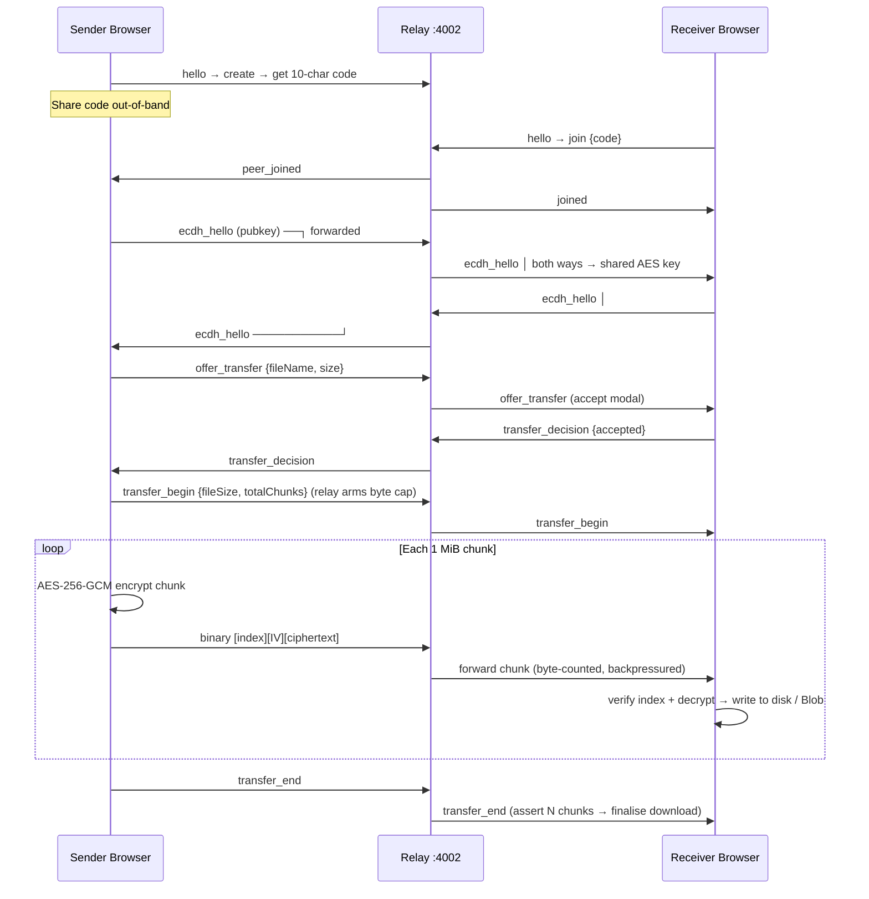

# NexDrop

> **Instant file sharing — no accounts, no installs, no servers see your bytes.**

Two browsers, one share code, a file moves. The relay in the middle pairs the two
sides and forwards opaque ciphertext — it never sees the file contents or the
encryption key.

---

## Table of Contents

- [Project Structure](#project-structure)
- [Tech Stack](#tech-stack)
- [Quick Start](#quick-start)
- [Architecture Overview](#architecture-overview)
- [Security Model](#security-model)

---

## Project Structure

```
NexDrop/
├── backend/                ← Node.js + TypeScript (relay only)
│   ├── src/
│   │   ├── relay.ts        ← Remote relay entry point
│   │   ├── transport/
│   │   │   └── relayServer.ts   ← rooms, pairing, E2EE chunk forwarding
│   │   └── config.ts       ← RELAY_* env vars (LAN constants commented out)
│   └── README.md
├── frontend/               ← React 19 + Vite + TypeScript
│   ├── src/
│   │   ├── App.tsx         ← Single route → Remote page
│   │   ├── pages/Remote.tsx
│   │   ├── hooks/useRemoteTransfer.ts
│   │   ├── lib/remoteCrypto.ts
│   │   └── lib/remoteStatus.ts
│   └── README.md
└── render.yaml             ← Render Blueprint (one-click relay deploy)
```

---

## Tech Stack

| Layer | Technology |
|---|---|
| Relay | Node.js 18+, TypeScript 5.8, `ws` |
| Frontend | React 19, Vite 7, TypeScript 5.9 |
| Transport | WebSocket relay (`ws` / `wss`) |
| Encryption | ECDH P-256 → HKDF-SHA256 → AES-256-GCM (file contents, E2E) |
| Pairing | 10-char Crockford Base32 share code (50 bits entropy) |
| Large files | File System Access API (stream to disk) / Blob fallback |

---

## Quick Start

```bash
# 1. Clone
git clone <repo> && cd NexDrop

# 2. Start the relay (new terminal)
cd backend && npm install && npm run dev

# 3. Start the frontend (new terminal)
cd frontend && npm install && npm run dev
```

- Frontend: http://localhost:5173
- Relay WebSocket: ws://localhost:4002

Open the frontend in two browsers, copy the share code from one into the
other, and drop a file in.
---

## Architecture Overview

Two browsers connect to a small WebSocket **relay** over `wss://`. The relay
pairs them by share code and forwards opaque, end-to-end-encrypted chunks
between them. **It performs zero crypto and never sees plaintext** — only
ciphertext bytes, sizes, file name, timing, and peer IPs.

```
Sender Browser ─── wss ───► Relay (cloud) ─── wss ───► Receiver Browser
        host or joiner       pairs 2 conns        joiner or host
  File contents E2EE: ECDH P-256 → HKDF-SHA256 → AES-256-GCM
  Relay sees: ciphertext chunks, byte counts, file name/size, timing, peer IPs
  Relay never sees: file contents (plaintext), the encryption key
```



---

## Security Model

| Property | Value |
|---|---|
| Topology | Relayed (server in the byte path) |
| Key exchange | ECDH P-256 (per pairing, ephemeral) |
| Content encryption | AES-256-GCM (per chunk, end-to-end) |
| Integrity | AES-GCM tag per chunk + monotonic 4-byte index + totalChunks count |
| Forward secrecy | Yes (ephemeral key pair per pairing) |
| Relay sees file **contents** | Never (ciphertext only) |
| Relay sees **metadata** | File name, size, timing, peer IPs |
| Transport security | `wss://` (TLS) to the relay |
| Auth required | None — share code is the capability (50 bits entropy) |
| Origin check on WS upgrade | Yes (CWE-352 / CSWSH) |
| Rate limiting | Per-IP connection cap + per-conn token bucket + failed-join limit |
| Resource bounds | 5 GiB byte cap per transfer, room TTLs, control-frame cap |

---
