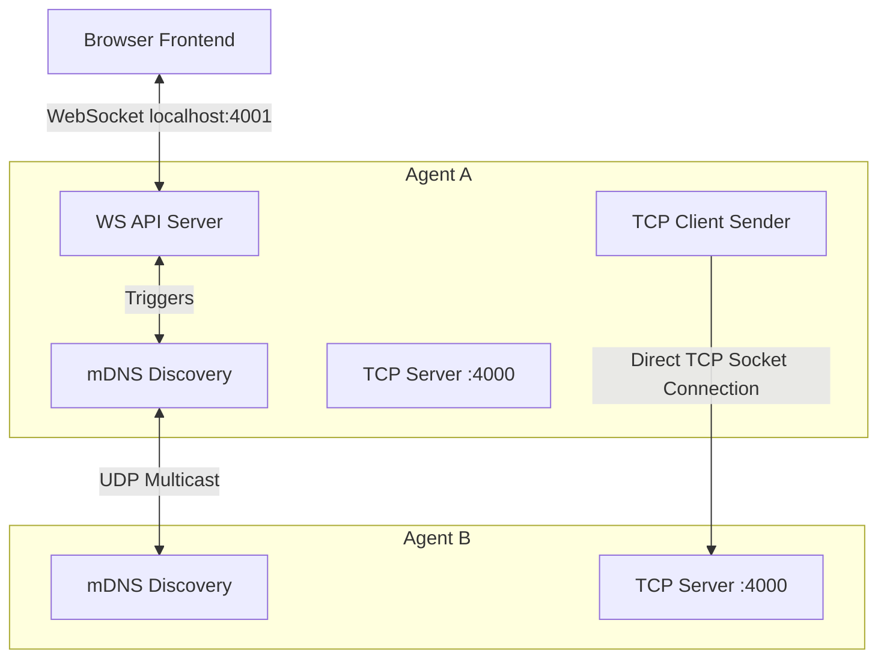
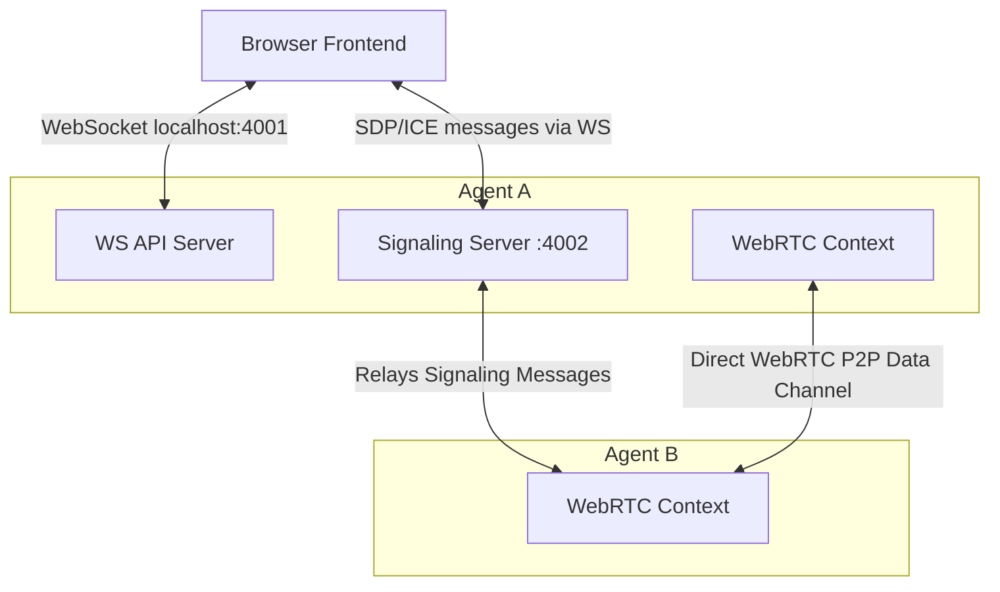

# PeerDrop Local Agent

This repository contains the backend agent for PeerDrop, a Peer-to-Peer file sharing application designed for seamless LAN and potential remote file transfers.

## System Level Design (HLD)

### 1. LAN File Transfer Flow (Current)

This is the active mode when two devices are on the same local network (Wi-Fi). The browser communicates with its own local agent, which then communicates directly with the destination agent via TCP.



### 2. Remote File Transfer Flow (Future)

When devices are not on the same network, direct TCP connections are not easily possible. A WebRTC signaling server acts as a relay to exchange connection candidates (ICE/SDP) so the WebRTC layer in the browser/client can establish a direct data channel.



---

## Detailed Data & Request Flow (LAN Transfer)

### 1. Application Startup & Frontend Initialization

- **Backend Boot**: Upon running the project, `index.ts` initializes the `MdnsService` (`.advertise()` and `.browse()`), spins up the WebSocket API `WsApiServer` on port `4001`, starts the `TCP Server` on port `4000`, and the `Signaling Server` on port `4002`.
- **Frontend Connects**: The user opens the web frontend, which instantly attempts to establish a WebSocket (`ws://`) connection to the local agent at `localhost:4001`.
- **WS Upgrade Authentication**: The agent HTTP server intercepts the upgrade. By default, it verifies the remote IP is `127.0.0.1`. (If `ALLOW_REMOTE_WS=true` is set, external IPs via reverse proxies like ngrok are allowed).
- **Agent Ready**: On a successful WebSocket connection, the backend immediately emits a JSON `{ type: "agent_ready" }` event containing the device name and agent ID down to the frontend.
- **Peer Discovery**: The frontend can explicitly request a list of peers using the `discover_peers` WS message. The backend uses mDNS to scan the local network and responds with a broadcast `{ type: "peers_update" }` containing all discovered peer IPS and ports.

### 2. Device and File Chosen

When User A selects a file and clicks "Send" targeting User B:

1. **Frontend Streams File to Backend**:
   - Frontend sends a setup JSON frame: `{ type: "send_file_start", peerId, fileName, totalChunks, ... }` to the local WS API.
   - The frontend reads the local file, splits it into chunks, and streams binary WS frames sequentially. Each frame is prefixed with a 4-byte chunk index.
   - The frontend sends a completion JSON frame: `{ type: "send_file_end", peerId, fileName }`.
2. **Backend Assembles**:
   - During streaming, `WsApiServer` continuously buffers these binary payloads in memory.
   - Upon receiving `send_file_end`, it concatenates the chunks into a final full `Buffer` object.
   - The WS Server then triggers the internal `onSendFile` callback, passing the file buffer to the `TCP Client` sender mechanism (`sendFileToPeer`).

### 3. Direct P2P Network Transfer Initialization

1. **TCP Connection**: Agent A (`TCP Client`) opens a raw TCP socket connection pointing directly to Agent B's discovered LAN IP on port `4000`.
2. **Key Exchange (ECDH)**: Agent B's TCP server immediately sends its ephemeral ECDH public key over the socket. Agent A derives a strong secure session key from it.
3. **Metadata Frame**: Agent A sends a newline-delimited JSON `METADATA` frame (containing the `transferId`, `fileName`, file hash, and its own public key) to Agent B.

### 4. Transfer Acceptance / Rejection

Upon receiving the `METADATA` frame, Agent B's `TCP Server`:

1. **Notifies Frontend**: Triggers the `onOffer` callback. `WsApiServer` broadcasts `{ type: "transfer_offer", transfer }` down to User B's browser, triggering a UI modal.
2. **Pending State**: The TCP server pauses execution, registering a promise in a `PendingDecisionMap` with a hard timeout of 60 seconds.
3. **User Action**:
   - **If User B Rejects**: Frontend sends `{ type: "reject_transfer", transferId }` via WS. The `TCP Server` resolves the map, writes a `REJECT` JSON frame to Agent A over the socket, and destroys the connection. Agent A updates its UI to show "Rejected".
   - **If User B Accepts**: Frontend sends `{ type: "accept_transfer", transferId }`. The `TCP Server` resolves the map, writes an `ACCEPT` JSON frame to Agent A, and prepares to read file chunks.

### 5. Transfer Execution & File Writing

If the transfer is accepted:

1. **Chunking & Encryption**: Agent A's `TCP Client` splits the memory file buffer into 256KB segments. Each segment is strictly encrypted using AES-256-GCM.
2. **Streaming**: Agent A writes stringified `CHUNK` frames containing the JSON payload: `index`, AES IV, AES AuthTag, and Base64-encoded encrypted chunk data. Backpressure is managed automatically by respecting Node.js `.write()` drain events.
3. **Real-time Progress**: As pieces flow over the socket and get decrypted/verified, both Agents A and B emit continuous `transfer_update` messages to their respective browser WS connections to update UI progress bars.
4. **Finalization**:
   - Agent A finally sends a `DONE` frame indicating the end of the file.
   - Agent B reassembles all verified raw chunks into a single file buffer, matches the master SHA-256 hash against the original metadata, and writes the output to the root `<ProjectDir>/downloads` directory.
   - The TCP connection is closed safely, and both frontends reflect a "Completed" status.

---

## User Setup Guide

### Prerequisites

- [Node.js](https://nodejs.org/) (Version 18 or higher recommended)
- `npm` (comes with Node.js)
- Optionally: TypeScript compiler `tsc` installed globally.

### Installation & Execution

1. Open a terminal and navigate to the project directory:
   ```bash
   cd /path/to/PeerDrop-Backend
   ```
2. Install dependencies:
   ```bash
   npm install
   ```
3. Run the development server:
   ```bash
   npm run dev
   ```

Upon running, you'll see a console banner displaying your device name, LAN IP address, and successfully bound ports (4000 for transfers, 4001 for WebSocket UI).

### Connecting the Browser Frontend

1. Open your browser-based frontend React application.
2. Ensure the frontend's WebSocket configuration points to your agent at `ws://localhost:4001`.
3. To test transfers between two machines, run the agent on both Machine A and Machine B. They must be connected to the exact same Wi-Fi router or Local Network. The applications will auto-discover each other using mDNS.

### Using with a Mobile Device (Ngrok)

If you wish to use a mobile browser connecting to a desktop agent (e.g., using your phone's browser to send a file to your PC):

1. Start the agent with remote WebSocket connections permitted:
   ```bash
   ALLOW_REMOTE_WS=true npm run dev
   ```
2. Expose the agent's WebSocket port to the internet safely via Ngrok:
   ```bash
   ngrok http 4001
   ```
3. Access your frontend on your mobile device and paste the generated `wss://<ngrok-url>` as the WebSocket endpoint to pair it with your laptop's agent.
