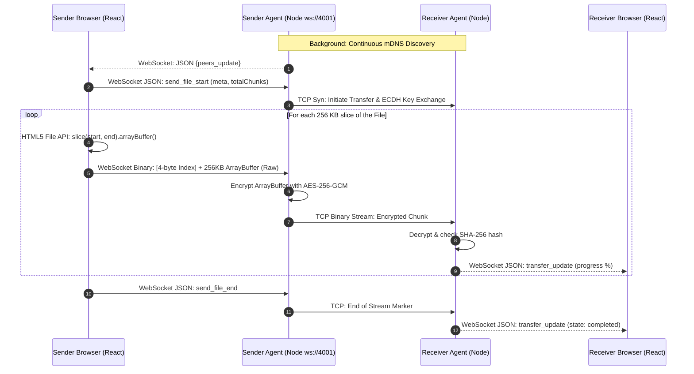
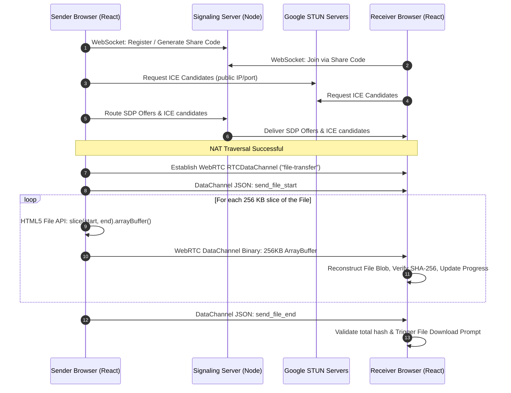

# PeerDrop

Secure, peer-to-peer file transfer utility for LAN and Remote networks. End-to-end encrypted with no file bytes ever stored on a central server.

## Features & Technical Overview

- **Zero Server Storage**: Files pass directly from browser to browser (Remote) or browser to local-agent to local-agent (LAN).
- **Chunking Strategy**: Files are sliced via HTML5 File API into `256 KB` binary chunks. Chunks are sent sequentially over the wire via `ArrayBuffer` to prevent memory bloat on large files.
- **Integrity**: Every chunk and the finalized file are validated via SHA-256 hash checks.
- **Encryption**: ECDH key exchange establishes a shared secret per session, with AES-256-GCM encrypting each chunk prior to transport.

## Setup & Usage

### 1. Frontend Setup (React/Vite)

```bash
# Install dependencies
npm install

# Start development server
npm run dev
```

Access the application at `http://localhost:5173`.

### 2. Backend Setup (LAN Agent & Signaling)

_Required for LAN transfers & Remote discovery._

```bash
cd backend
npm install
npm run dev
```

The agent listens on `ws://localhost:4001` by default and utilizes `mDNS` to broadcast its presence on the local network.

---

## System Level Design (SLD)

### 1. LAN Transfer Mode

In **LAN Mode**, the React application delegates networking and cryptography processing to a local Node.js daemon (the "Agent"). The Agent handles mDNS peer discovery, file encryption, and establishing a high-throughput raw TCP connection over the local network.



### 2. Remote Transfer Mode

In **Remote Mode**, the frontend applications connect directly, browser-to-browser, using WebRTC `RTCDataChannel`. The signaling server only maps connection codes and routes `SDP` and `ICE` payloads to establish the connection geometry. **It never touches the file bytes**.


